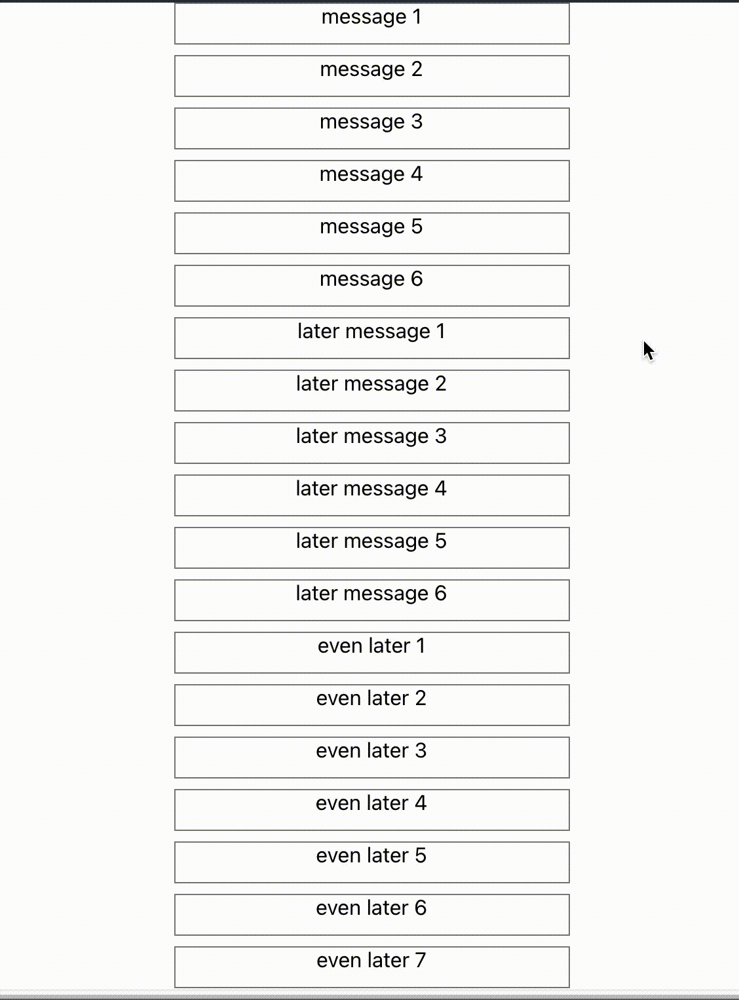
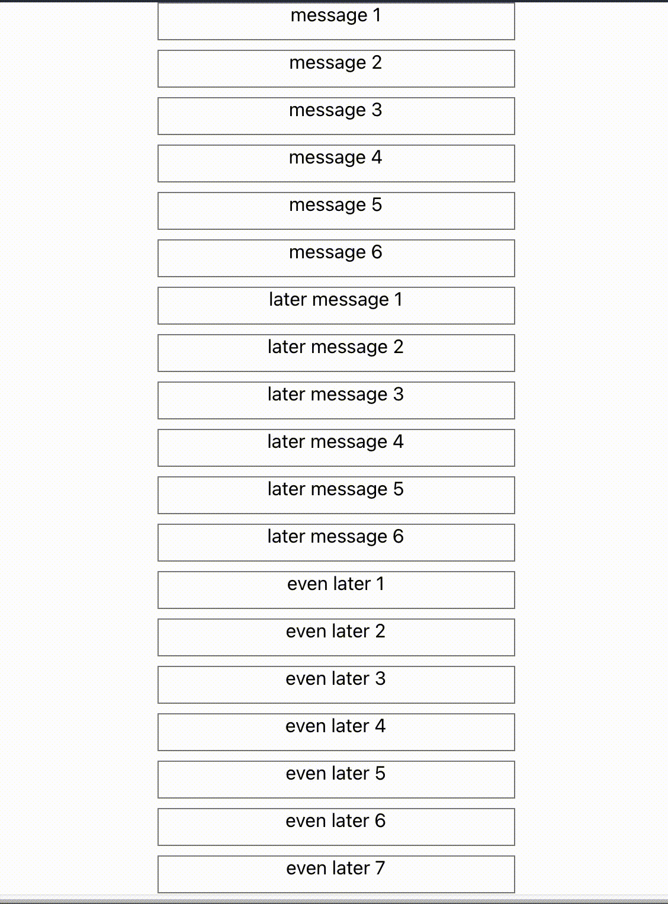

# Experiment with react hooks and smooth UX

Entertained with my useTimedCount hook, I've done other experiments building small things with it. In this case I wanted to create a component with the following interface, where you cna easily control the speed of the different transitions via the `timeout` props.

```
<TimedList
  timeout={number}
  fadeProps={{ timeout: number }}
  slideProps={{ timeout: number }}
>
 <Item/>
 <Item/>
 <Item/>
 <Item/>
</TimedList>
```

The two gifs below are examples of code built on top of this custom react-hook.

```
function useTimedCount(max: number, interval?: number) {
  const [count, setCount] = useState(0);
  useEffect(() => {
    const timeout = setTimeout(() => {
      if (count < max) {
        setCount(count + 1);
      }
    }, interval ?? 1);
    return () => {
      clearTimeout(timeout);
    };
  }, [count, setCount, interval, max]);
  return count;
}
```

## Examples

NOTE: Gif videos look much slower than the actual animation.

With MaterialUI Fade:



With MaterialUI Slide:


